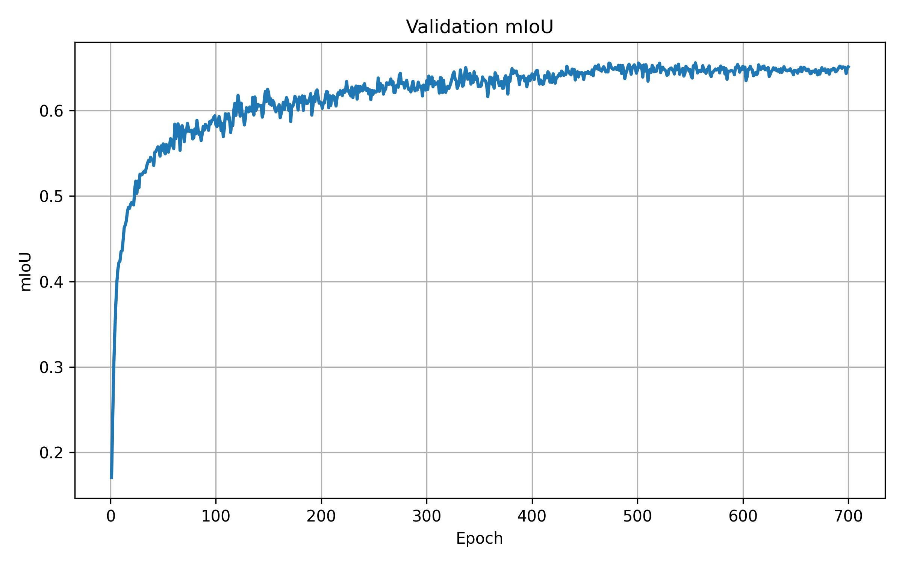
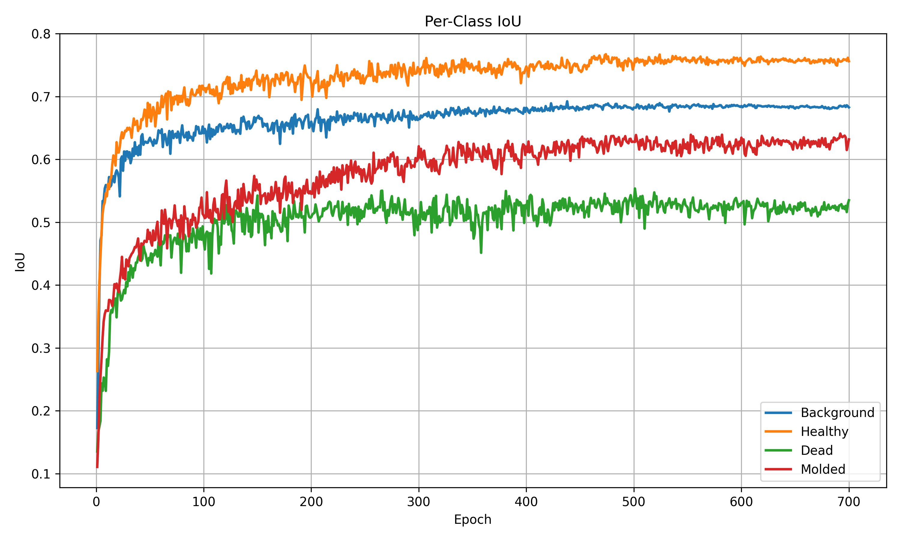
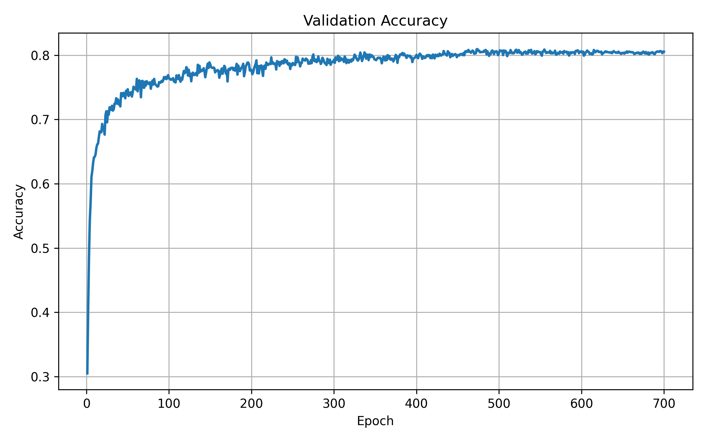
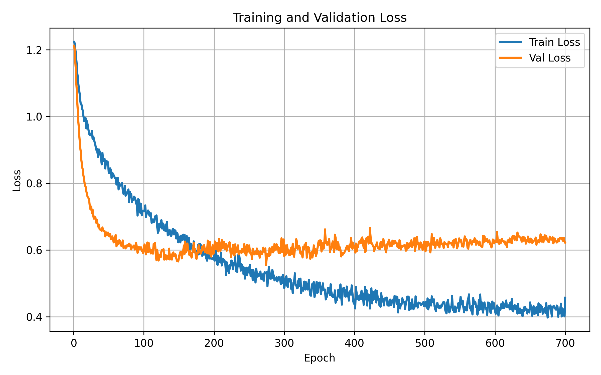
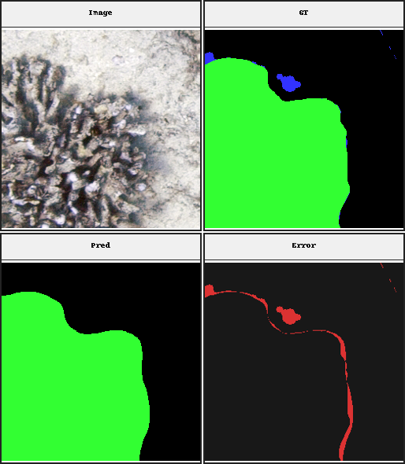
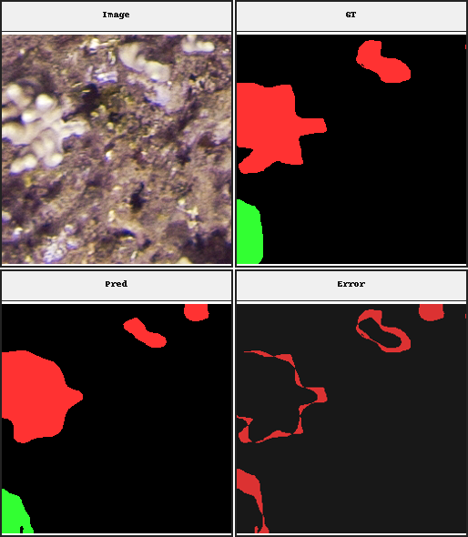
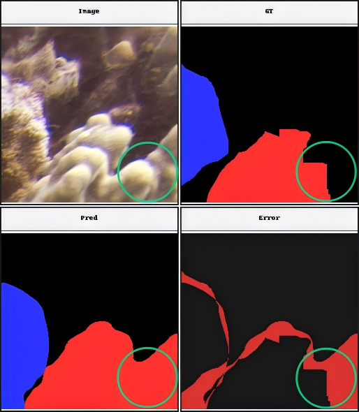
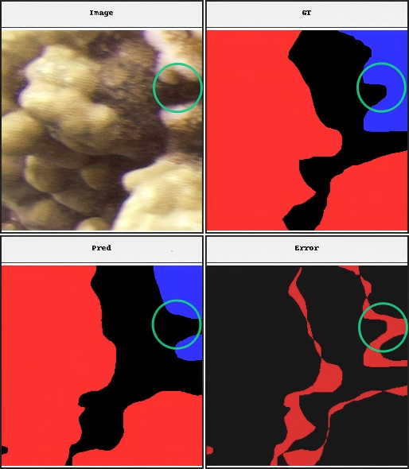

# coral_image_segform
Foundation Model Image Segmentation Competition Project

## 📈 Training Curves

  <table>
    <tr>
      <td align="center"><b>mIOU Curve</b> </td>
      <td align="center"><b>Class IOU Curve</b> </td>
    </tr>
    <tr>
      <td align="center"><b>Accuracy Curve</b> </td>
      <td align="center"><b>Loss Curve</b> </td>
    </tr>
  </table>

## Qualitative Comparison

    

    可观察到比赛提供的真实标签存在一定错标现象（如绿色圈出部分）。
    针对该问题，采用脏数据处理方法后，可有效降低噪声标签的影响。
  

  <table style="border-collapse: collapse; border: none;">
    <tr>
      <!-- 第一行：普通场景 -->
      <td align="center" style="border: none; padding: 10px;">
        <b>Standard Prediction</b> 
        
      </td>
      <td align="center" style="border: none; padding: 10px;">
        <b>Standard Prediction (Case 2)</b> 
        
      </td>
    </tr>
    <tr>
      <!-- 第二行：脏数据处理场景（重点） -->
      <td align="center" style="border: none; padding: 10px; background-color: #f0f7ff;">
        <b>Dirty Data Handling ✨</b> 
        
      </td>
      <td align="center" style="border: none; padding: 10px; background-color: #f0f7ff;">
        <b>Dirty Data Handling ✨</b> 
        
      </td>
    </tr>
  </table>

## 
